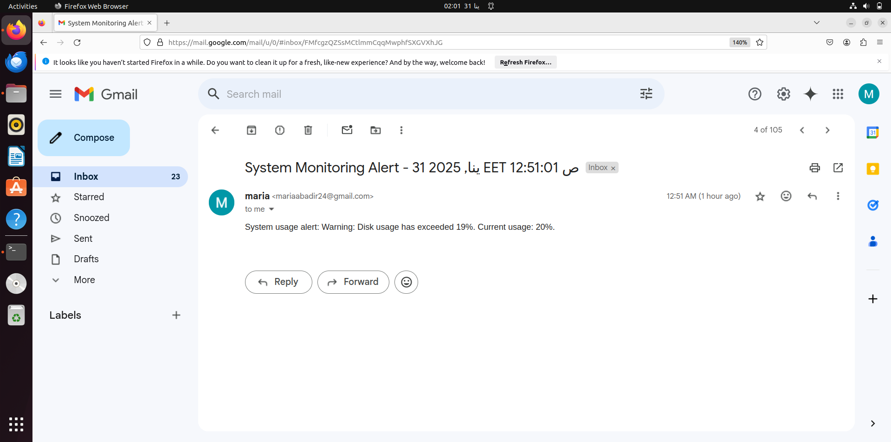
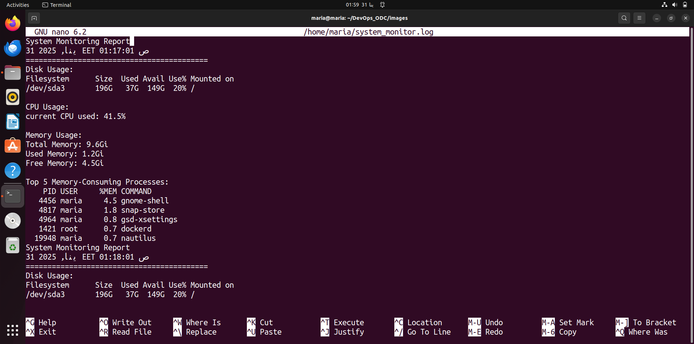

# DevOps_ODC
# TASK 1: System Monitor Script
    
   ## Description
    
   This **System Monitor Script** helps monitor key system metrics like CPU usage, memory usage, disk usage, and system load. The script is designed to provide real-time      information on your system's health and can be scheduled to run periodically via cron jobs. The script logs output, sends warnings if system resource usage exceeds         set thresholds, and sends an email notification when a threshold is exceeded.
    
   ## Features
    
  - Monitors CPU, memory, disk, and system load.
  - Allows custom thresholds for warnings.
  - Can output to a log file.
  - Sends an email notification when any resource exceeds the specified threshold.

    ## Output

   
   
